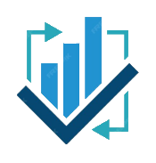
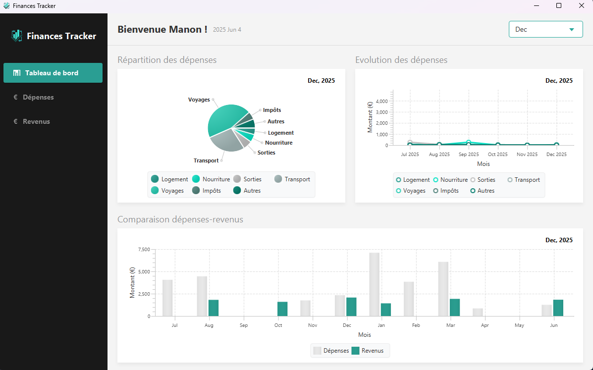
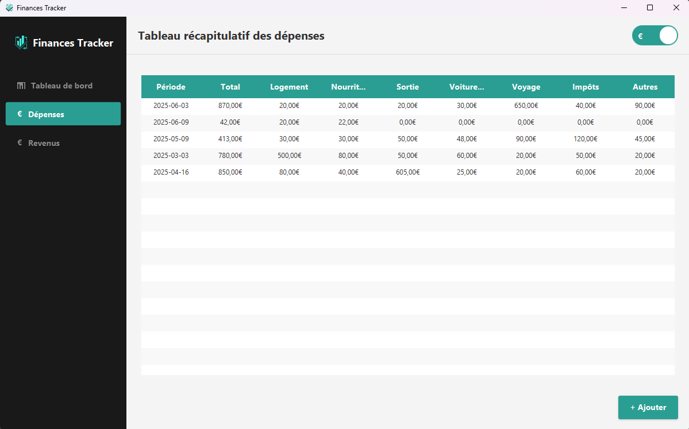

#  Finances Tracker

Project by [__ARCAS__ Manon](https://github.com/Manon-Arc) and [__MACE__ Léo](https://github.com/LeoMa33).

Welcome to the Finances tracker project ! <br>

This project is aimed at providing a desktop application to manage your monetary expenses and
incomes.

### 📌 Table of contents :

I. [About the project](#💡-about-the-project)

II. [Technologies used](#⚙️-technologies-used)

II. [Features](#🌟-availables-features)

III. [Architecture](#​📋​-architecture)

IV. [Project structure](#📁-project-structure)

IV. [Installation](#📥-install-the-project)

V. [Development](#💻-development)

### 💡 About the project :

Finances Tracker is a desktop application developed to help users track their personal finances. It
offers an intuitive interface to record expenses and incomes, view detailed charts, and gain a clear
overview of your financial situation.

The application stores all your data locally, ensuring your privacy while offering advanced analysis
features.

#### View

<div style="display: flex; flex-direction: row; gap: 10px">
    
    
</div>

### ⚙️ Technologies used :


### 🌟 Availables Features :

#### Financial management

- **Expenses Tracking**: Record and categorize all your spending
- **Incomes Management**: Keep track of all your revenue sources
- **Data Visualization**: Analyze your finances through intuitive charts:
    - Pie charts for expense distribution
    - Line charts for spending trends
    - Bar charts comparing income vs expenses
- **Month-by-Month Analysis**: Filter your financial data by month

#### Others features

- **Local storage**: Your data remains on your computer for optimal security
- **Logging**: Detailed tracking of operations for easier debugging

### ​📋​ Architecture :

The application is built according to an MVC (Model-View-Controller) architecture for better
separation of responsibilities:

```plaintext
+---------------------+       +----------------------+       +-------------------+
|       Models        |<----->|     Controllers      |<----->|       Views       |
| (Expense, Income)   |       | (TabControllers)     |       | (FXML + CSS)      |
+---------------------+       +----------------------+       +-------------------+
          ^                            ^
          |                            |
          v                            v
+---------------------+       +----------------------+
|     Database        |<----->|      Services        |
|      SQLite         |       | (DAO, ApiCall)       |
+---------------------+       +----------------------+
```

### 📁 Project structure

- [📁 desktopproject](/src/main/java/com/example/desktopproject/): Java source code
    - **`model/`**: Business classes (Expense, Income, Monetary, etc.)
    - **`controller/`**: JavaFX controllers
    - **`db/`**: Data access (DAO)
    - **`charts/`**: Chart management classes
    - **`component/`**: Custom UI components
- [📁 resources](/src/main/resources/): Application resources
    - **`/css/`**: Style sheets
    - **`/fxml/`**: View definition files
    - **`/images/`**: Icons and images

### 📥 Install the project :

#### Prerequisites

- **OS**: Windows 10/11, macOS, or Linux
- **Java**: Version 21 or higher
- **Disk Space**: Approximately 125Mo

#### Method 1: Installation via the installer

1. Download the latest version of the installer from the GitHub Actions page
2. Run the installation file
3. Follow the on-screen instructions to complete the installation
4. Launch the application from the Start menu or the Desktop shortcut

#### Method 2: For developers

1. Clone the repository: `git clone https://github.com/Mizury26/Finances_tracker.git`
2. Navigate to the project directory: `cd Finances_tracker`
3. Compile the project with Gradle: `gradle build --scan`
4. Run the application: `java -jar target/finances-tracker-1.0-SNAPSHOT.jar`

***We recommend you to use [IntelliJ IDEA](https://www.jetbrains.com/fr-fr/idea/#)***

### 💻 Development :

#### Continuous integration

This project uses GitHub Actions for continuous integration:

- **Automatic build**: Compilation check with every commit to the main branch
- **Unit tests**: Execution of automated tests
- **Artifact creation**: Generation of Windows, MacOS and Linux installers for each successful build

#### Execute test

To run the current test, you need to execute: `./gradlew test`

The class being tested is `ChangeType`, which checks that the currency conversion is performed
correctly.

___
Developed with ❤️ by  [__ARCAS__ Manon](https://github.com/Manon-Arc) and [__MACE__ Léo](https://github.com/LeoMa33).


